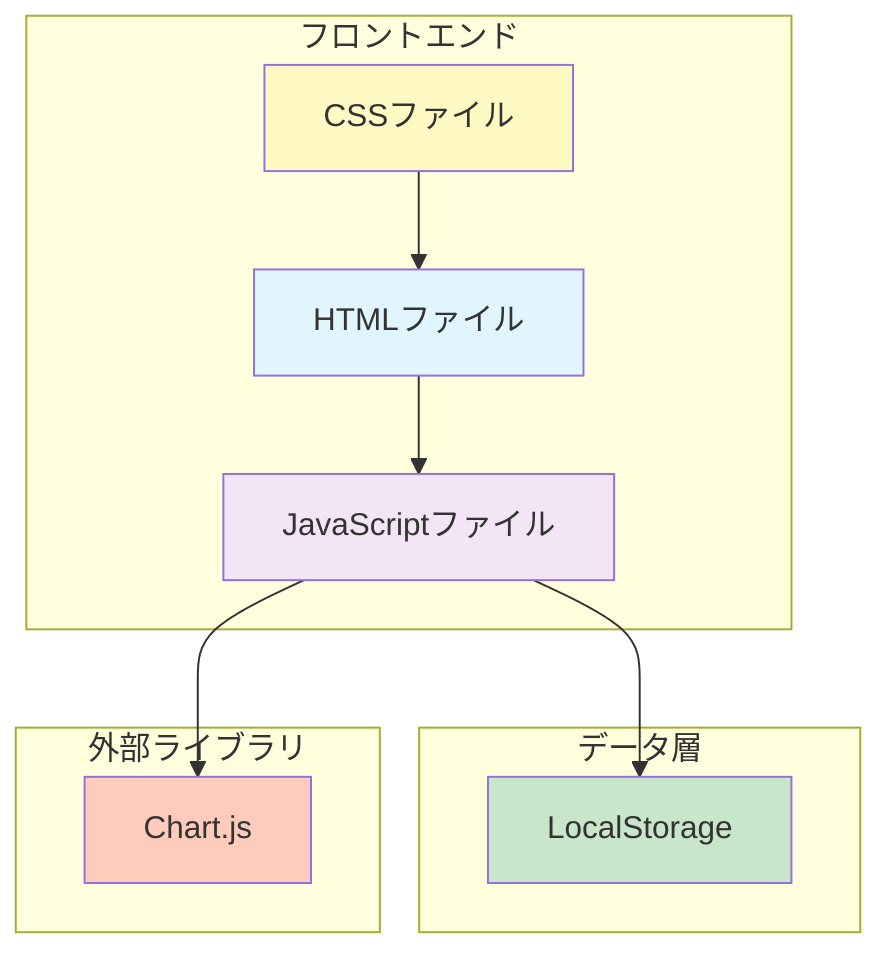
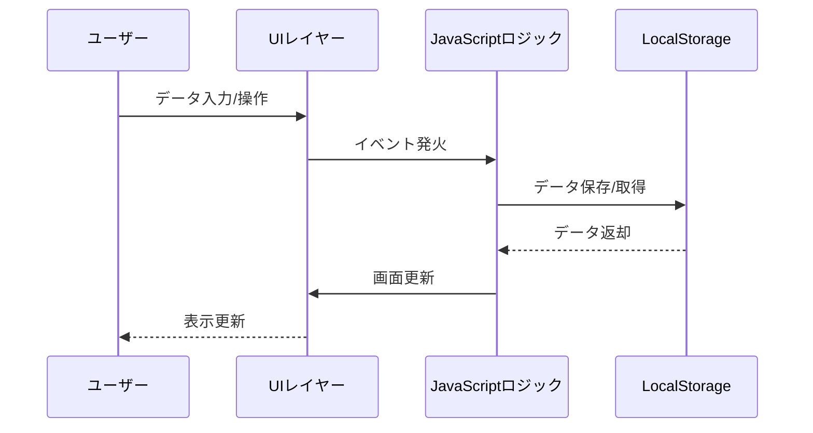
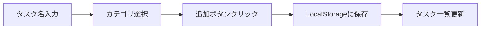
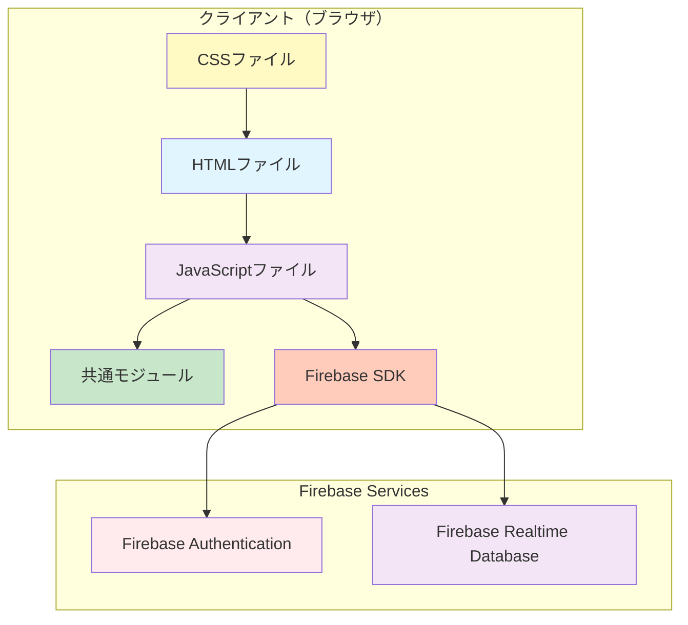
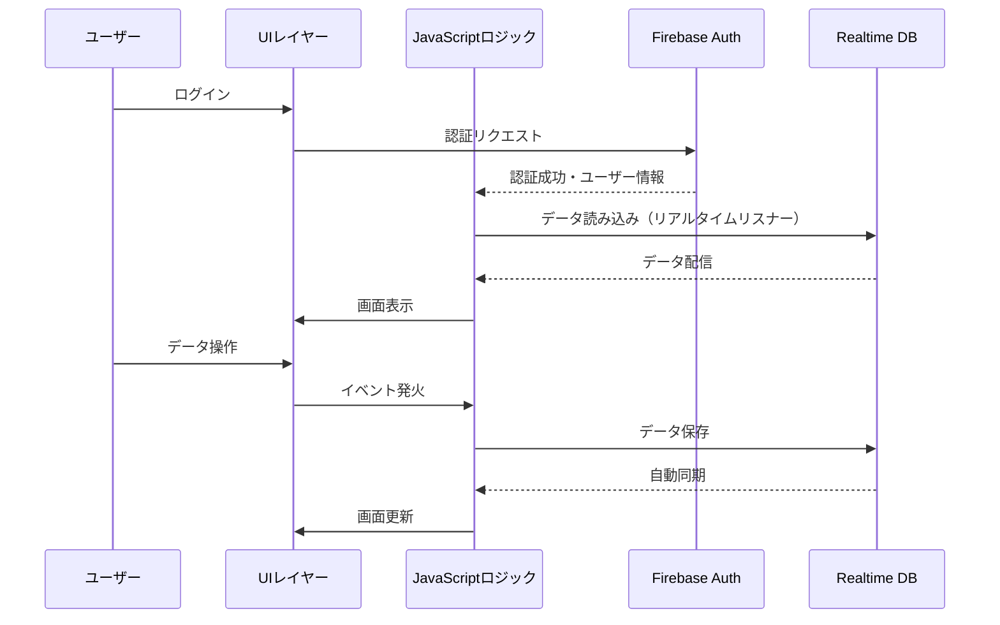
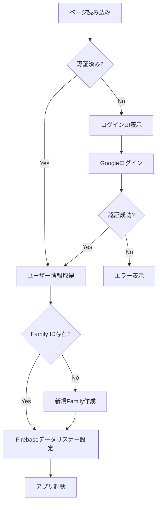
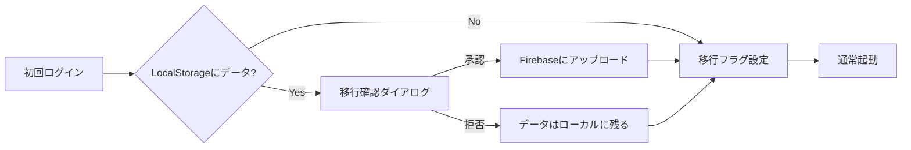

# MyHomeManager 詳細設計書

## 1. システム概要

### 1.1 プロジェクト名
MyHomeManager

### 1.2 バージョン
1.0.0（最終更新: 2025年11月23日）

### 1.3 目的
家庭管理を効率化するためのWebアプリケーション。タスク管理、出納帳、カレンダー機能を提供し、家庭内の日常業務を一元管理する。

### 1.4 技術スタック
- **フロントエンド**: HTML5, CSS3, JavaScript (Vanilla)
- **データ管理**: LocalStorage (ブラウザベース)
- **外部ライブラリ**: Chart.js 4.4.0 (データ可視化)

---

## 2. アーキテクチャ設計

### 2.1 システム構成



### 2.2 ディレクトリ構造

```
MyHomeManager/
├── html/             # HTMLファイル
│   ├── top.html      # ホーム画面（タスク管理）
│   ├── cashbook.html # 出納帳
│   ├── calendar.html # カレンダー
│   └── settings.html # 設定
├── css/              # スタイルシート
│   ├── top.css       # ホーム画面用
│   ├── cashbook.css  # 出納帳用
│   ├── calendar.css  # カレンダー用
│   ├── settings.css  # 設定用
│   └── sidebar.css   # 共通サイドバー
├── js/               # JavaScriptファイル
│   ├── top.js        # ホーム画面ロジック
│   ├── cashbook.js   # 出納帳ロジック
│   ├── calendar.js   # カレンダーロジック
│   └── settings.js   # 設定ロジック
└── doc/              # ドキュメント
    └── 詳細設計書.md
```

### 2.3 データフロー



---

## 3. 画面設計

### 3.1 共通レイアウト

すべての画面は以下の共通構造を持つ:

```
┌─────────────────────────────────────┐
│ ☰ ページタイトル                      │ Header
├──────┬──────────────────────────────┤
│      │                              │
│ サイド│                              │
│ バー │  メインコンテンツ             │ Main Content
│      │                              │
│      │                              │
└──────┴──────────────────────────────┘
```

#### 共通要素
- **ヘッダー**: サイドバートグルボタン (☰) とページタイトル
- **サイドバー**: ナビゲーションメニュー
  - ホーム
  - 出納帳
  - カレンダー
  - 設定
- **オーバーレイ**: サイドバー展開時の背景ダークレイヤー

### 3.2 ホーム画面 (top.html)

**機能**: 日々のタスク管理

**主要コンポーネント**:
1. **タスク一覧**: 登録済みタスクの表示
2. **タスク追加フォーム**:
   - タスク名入力欄 (必須)
   - カテゴリ選択 (掃除/買い物/修理/その他)
   - 追加ボタン

**UIフロー**:


### 3.3 出納帳画面 (cashbook.html)

**機能**: 家計の収支管理とデータ可視化

**主要コンポーネント**:
1. **データアクション**:
   - エクスポートボタン (JSON形式)
   - インポートボタン (JSON形式)
2. **収支エントリフォーム**:
   - 日付選択
   - 説明入力
   - 金額入力
   - カテゴリ選択 (収入/支出/その他)
3. **収支テーブル**: 日付、説明、カテゴリ、金額、操作
4. **データビジュアライゼーション**:
   - 月次収支推移グラフ (折れ線グラフ)
   - カテゴリ別内訳 (ドーナツチャート)

**データ構造**:
```javascript
{
  date: "YYYY-MM-DD",
  desc: "説明文",
  amount: 数値,
  category: "収入" | "支出" | "その他"
}
```

### 3.4 カレンダー画面 (calendar.html)

**機能**: イベント管理とカレンダー表示

**主要コンポーネント**:
1. **カレンダーヘッダー**:
   - 前月ボタン (◀)
   - 現在の年月表示
   - 次月ボタン (▶)
2. **カレンダーグリッド**: 7列×6行の日付セル
3. **イベント追加フォーム**:
   - 日付選択
   - イベント名入力
   - 時刻入力 (オプション)
4. **今後のイベント一覧**: 日付順にソートされた未来のイベント

**データ構造**:
```javascript
{
  date: "YYYY-MM-DD",
  title: "イベント名",
  time: "HH:MM" (オプション)
}
```

### 3.5 設定画面 (settings.html)

**機能**: アプリケーション設定とデータ管理

**主要コンポーネント**:
1. **表示設定**:
   - アプリ名変更
   - テーマ選択 (ライト/ダーク※準備中)
2. **通知設定** (準備中):
   - 通知有効化
   - イベントリマインダー
3. **データ管理**:
   - タスクデータ削除
   - 出納帳データ削除
   - カレンダーイベント削除
   - すべてのデータ削除
4. **アプリケーション情報**:
   - バージョン: 1.0.0
   - 最終更新: 2025年11月23日

---

## 4. データ設計

### 4.1 LocalStorage キー一覧

| キー名 | 用途 | データ型 |
|--------|------|----------|
| `tasks` | タスク一覧 | Array\<TaskData\> |
| `cashbookEntries` | 出納帳エントリ | Array\<EntryData\> |
| `calendarEvents` | カレンダーイベント | Array\<EventData\> |
| `appSettings` | アプリ設定 | SettingsObject |

### 4.2 データモデル

#### TaskData (タスク)
```javascript
{
  title: string,      // タスク名
  category: string    // カテゴリ ("掃除"|"買い物"|"修理"|"その他")
}
```

#### EntryData (出納帳エントリ)
```javascript
{
  date: string,       // 日付 "YYYY-MM-DD"
  desc: string,       // 説明
  amount: number,     // 金額
  category: string    // カテゴリ ("収入"|"支出"|"その他")
}
```

#### EventData (カレンダーイベント)
```javascript
{
  date: string,       // 日付 "YYYY-MM-DD"
  title: string,      // イベント名
  time: string        // 時刻 "HH:MM" (オプション)
}
```

#### SettingsObject (設定)
```javascript
{
  appName: string,              // アプリ名 (デフォルト: "MyHomeManager")
  theme: string,                // テーマ ("light"|"dark")
  enableNotifications: boolean, // 通知有効化
  reminderEvents: boolean       // イベントリマインダー
}
```

---

## 5. 機能設計

### 5.1 タスク管理機能 (top.js)

#### 5.1.1 主要関数

| 関数名 | 説明 | 引数 | 戻り値 |
|--------|------|------|--------|
| `renderTasks()` | タスク一覧を描画 | なし | void |
| `deleteTask(index)` | タスクを削除 | index: number | void |

#### 5.1.2 処理フロー

**タスク追加**:
1. フォーム送信イベントをキャッチ
2. タイトルとカテゴリを取得
3. 新しいタスクオブジェクトを作成
4. `tasks`配列に追加
5. LocalStorageに保存
6. フォームをリセット
7. `renderTasks()`で再描画

**タスク削除**:
1. 削除ボタンクリック
2. 配列からインデックスで削除
3. LocalStorageを更新
4. `renderTasks()`で再描画

### 5.2 出納帳機能 (cashbook.js)

#### 5.2.1 主要関数

| 関数名 | 説明 | 引数 | 戻り値 |
|--------|------|------|--------|
| `render()` | テーブルと合計を描画 | なし | void |
| `save()` | LocalStorageに保存 | なし | void |
| `formatYen(n)` | 円建て表示に整形 | n: number | string |
| `renderCharts()` | グラフを描画 | なし | void |

#### 5.2.2 データエクスポート/インポート

**エクスポート**:
1. `entries`配列をJSON文字列化
2. Blobオブジェクトを作成
3. ダウンロードリンクを生成
4. ファイル名: `cashbook_export_YYYY-MM-DD.json`

**インポート**:
1. ファイル選択ダイアログを表示
2. ファイルを読み込み
3. JSONをパース
4. 既存データに追加
5. LocalStorageを更新
6. 画面を再描画

#### 5.2.3 データビジュアライゼーション

**月次収支推移グラフ**:
- タイプ: 折れ線グラフ (Line Chart)
- データセット:
  - 収入 (緑色、#4caf50)
  - 支出 (赤色、#f44336)
- X軸: 月 (YYYY-MM)
- Y軸: 金額

**カテゴリ別内訳**:
- タイプ: ドーナツチャート (Doughnut Chart)
- データ: カテゴリごとの金額合計

### 5.3 カレンダー機能 (calendar.js)

#### 5.3.1 主要関数

| 関数名 | 説明 | 引数 | 戻り値 |
|--------|------|------|--------|
| `renderCalendar()` | カレンダーを描画 | なし | void |
| `createDayElement(day, isOtherMonth, date)` | 日付セルを生成 | day: number, isOtherMonth: boolean, date: Date | HTMLElement |
| `formatDate(date)` | 日付を文字列化 | date: Date | string |
| `renderEventsList()` | イベント一覧を描画 | なし | void |
| `deleteEvent(event)` | イベントを削除 | event: EventData | void |
| `saveEvents()` | LocalStorageに保存 | なし | void |

#### 5.3.2 カレンダー描画アルゴリズム

1. **ヘッダー行**: 曜日（日〜土）を配置
2. **前月の日付**: 当月1日の曜日に基づき、必要な前月の日付を配置
3. **当月の日付**: 1日から月末までループ
   - 今日の日付には`.today`クラスを付与
   - イベントがある日付にはドット表示
4. **次月の日付**: グリッドを埋めるために必要な日数を配置

#### 5.3.3 イベント管理

**イベント追加**:
1. フォーム送信
2. 日付、タイトル、時刻を取得
3. `events`配列に追加
4. LocalStorageに保存
5. フォームリセット
6. カレンダーとイベント一覧を再描画

**イベント削除**:
1. 削除ボタンクリック
2. 日付、タイトル、時刻で一致するイベントを検索
3. 配列から削除
4. LocalStorageを更新
5. 再描画

### 5.4 設定機能 (settings.js)

#### 5.4.1 主要関数

| 関数名 | 説明 | 引数 | 戻り値 |
|--------|------|------|--------|
| `loadSettings()` | 設定を読み込み | なし | void |
| `saveSettings()` | 設定を保存 | なし | void |
| `clearTasks()` | タスクデータ削除 | なし | void |
| `clearCashbook()` | 出納帳データ削除 | なし | void |
| `clearEvents()` | カレンダーデータ削除 | なし | void |
| `clearAll()` | 全データ削除 | なし | void |

#### 5.4.2 データクリア処理

すべてのクリア機能は以下のフローに従う:
1. 確認ダイアログを表示
2. ユーザー承認後にLocalStorageからデータを削除
3. 完了アラートを表示
4. `clearAll()`のみ2段階確認を実施

---

## 6. インターフェース設計

### 6.1 サイドバー (共通UI)

**実装場所**: 全ページに共通実装 (IIFE パターン)

#### 6.1.1 動作仕様

| 操作 | 動作 |
|------|------|
| トグルボタンクリック | サイドバーを開く/閉じる |
| 閉じるボタン (✕) | サイドバーを閉じる |
| オーバーレイクリック | サイドバーを閉じる |
| Escキー押下 | サイドバーを閉じる |

#### 6.1.2 アクセシビリティ

- `aria-hidden`: サイドバーの非表示状態を示す
- `aria-expanded`: トグルボタンの状態を示す
- `aria-label`: ボタンの用途を示す
- フォーカス管理: サイドバー内の最初のリンクにフォーカス移動

### 6.2 レスポンシブ対応

全ページで`<meta name="viewport" content="width=device-width, initial-scale=1.0">`を設定し、モバイルフレンドリーな表示を実現。

---

## 7. セキュリティとエラーハンドリング

### 7.1 XSS対策

**実装箇所**: `cashbook.js` - `escapeHtml()`関数

```javascript
function escapeHtml(text) {
  return String(text)
    .replaceAll('&', '&amp;')
    .replaceAll('<', '&lt;')
    .replaceAll('>', '&gt;')
    .replaceAll('"', '&quot;')
    .replaceAll("'", '&#39;');
}
```

ユーザー入力の説明文をテーブルに表示する際、HTMLエスケープ処理を実施。

### 7.2 データバリデーション

- **必須入力チェック**: HTML5の`required`属性を活用
- **数値入力**: `type="number"`で数値のみ許可
- **日付入力**: `type="date"`で正しい形式を保証
- **時刻入力**: `type="time"`で正しい形式を保証

### 7.3 エラーハンドリング

**インポート機能**:
```javascript
try {
  const importedData = JSON.parse(event.target.result);
  if (Array.isArray(importedData)) {
    // 処理
  } else {
    alert('無効なデータ形式です');
  }
} catch (error) {
  alert('ファイルの読み込みに失敗しました: ' + error.message);
}
```

---

## 8. パフォーマンス最適化

### 8.1 スクリプトロード

全JavaScriptファイルに`defer`属性を使用し、HTMLパース後に実行:
```html
<script defer src="../js/xxx.js"></script>
```

### 8.2 Chart.js の条件付きロード

出納帳ページのみChart.jsをロード、他ページでは不要。

### 8.3 IIFE パターン

グローバルスコープの汚染を防ぐため、各機能を即時実行関数式(IIFE)でカプセル化:
```javascript
(function() {
  // 機能実装
})();
```

---

## 9. ブラウザ互換性

### 9.1 対応ブラウザ

- Google Chrome (最新版)
- Mozilla Firefox (最新版)
- Microsoft Edge (最新版)
- Safari (最新版)

### 9.2 使用API

- **LocalStorage API**: データ永続化
- **File API**: インポート/エクスポート
- **Canvas API**: Chart.js によるグラフ描画

---

## 10. 将来の拡張計画

### 10.1 準備中機能

| 機能 | 状態 | 備考 |
|------|------|------|
| ダークモード | 準備中 | UI要素は実装済み |
| 通知機能 | 準備中 | 設定画面にチェックボックス配置済み |
| イベントリマインダー | 準備中 | 設定画面にチェックボックス配置済み |

### 10.2 拡張候補

- バックエンド連携 (データ同期)
- PWA化 (オフライン対応)
- 複数ユーザー対応
- タスクの期限設定
- 出納帳のカテゴリカスタマイズ
- CSVエクスポート/インポート
- カレンダーの週表示/月表示切り替え

---

## 11. 既知の制限事項

1. **データ容量**: LocalStorageの制限（約5-10MB）に依存
2. **同期**: 複数デバイス間でのデータ共有不可
3. **バックアップ**: 手動エクスポートのみ（自動バックアップなし）
4. **タイムゾーン**: ブラウザのローカルタイムゾーンに依存
5. **アクセス制御**: 認証機能なし（ブラウザレベルでのデータ分離のみ）

---

## 12. 用語集

| 用語 | 説明 |
|------|------|
| IIFE | Immediately Invoked Function Expression（即時実行関数式） |
| LocalStorage | ブラウザに永続的にデータを保存するWeb Storage API |
| Chart.js | JavaScriptのグラフ描画ライブラリ |
| XSS | Cross-Site Scripting（クロスサイトスクリプティング） |
| PWA | Progressive Web Application（プログレッシブウェブアプリケーション） |
| Aria | Accessible Rich Internet Applications（アクセシビリティ規格） |

---

## 付録: ファイル参照表

| ファイル名 | 行数 | 主要な役割 |
|-----------|------|-----------|
| top.html | 54 | ホーム画面のHTML構造 |
| calendar.html | 65 | カレンダー画面のHTML構造 |
| cashbook.html | 94 | 出納帳画面のHTML構造 |
| settings.html | 111 | 設定画面のHTML構造 |
| top.js | 87 | タスク管理ロジックとサイドバー制御 |
| calendar.js | 240 | カレンダー表示とイベント管理 |
| cashbook.js | 252 | 出納帳管理とグラフ描画 |
| settings.js | 121 | 設定管理とデータクリア |

---

---

## 13. Firebase実装設計（リアルタイム同期機能）

### 13.1 概要

**実装目的**: 複数ユーザー・複数デバイス間でのリアルタイムデータ同期を実現

**主な変更点**:
- データストレージ: LocalStorage → Firebase Realtime Database
- 認証機能の追加: Firebase Authentication（Googleアカウント）
- ファミリー（グループ）管理機能の追加

### 13.2 システムアーキテクチャ

#### 13.2.1 新しいシステム構成



#### 13.2.2 データフロー（Firebase版）



### 13.3 ファイル構成の変更

```
MyHomeManager/
├── index.html                    # GitHub Pages対応（旧top.html）
├── html/
│   ├── cashbook.html
│   ├── calendar.html
│   └── settings.html
├── js/
│   ├── common/                   # 共通モジュール（リファクタリング済み）
│   │   ├── sidebar.js            # サイドバー制御
│   │   ├── utils.js              # ユーティリティ関数
│   │   ├── storage.js            # LocalStorageラッパー
│   │   └── error-handler.js      # エラーハンドラー
│   ├── firebase-config.js        # 【新規】Firebase設定
│   ├── auth.js                   # 【新規】認証モジュール
│   ├── top.js
│   ├── cashbook.js
│   ├── calendar.js
│   └── settings.js
└── css/
```

### 13.4 Firebase設定

#### 13.4.1 Firebase初期化（firebase-config.js）

```javascript
// Firebase設定
const firebaseConfig = {
  apiKey: "YOUR_API_KEY",
  authDomain: "your-app.firebaseapp.com",
  databaseURL: "https://your-app.firebaseio.com",
  projectId: "your-project-id",
  storageBucket: "your-app.appspot.com",
  messagingSenderId: "123456789",
  appId: "1:123456789:web:abcdef"
};

// Firebase初期化
firebase.initializeApp(firebaseConfig);
```

**セキュリティ注意事項**:
- APIキーは公開されることを前提（Firebaseの設計思想）
- セキュリティはFirebase Security Rulesで保護
- `.gitignore`に追加推奨または環境変数化

### 13.5 認証設計

#### 13.5.1 認証フロー



#### 13.5.2 認証モジュール（auth.js）

**主要関数**:

| 関数名 | 説明 | 戻り値 |
|--------|------|--------|
| `loginWithGoogle()` | Googleアカウントでログイン | void |
| `logout()` | ログアウト | void |
| `getCurrentUser()` | 現在のユーザー取得 | User \| null |
| `getCurrentFamilyId()` | 現在のFamily ID取得 | string \| null |
| `getOrCreateFamily(userId)` | Family取得/作成 | Promise\<string\> |

**認証状態監視**:
```javascript
auth.onAuthStateChanged(async (user) => {
  if (user) {
    currentUser = user;
    currentFamilyId = await getOrCreateFamily(user.uid);
    
    // ページ固有の初期化処理を呼び出し
    if (window.onUserLoggedIn) {
      window.onUserLoggedIn(user, currentFamilyId);
    }
  } else {
    showLoginUI();
  }
});
```

### 13.6 データベース設計

#### 13.6.1 データ構造

```
firebase-root/
├── users/
│   └── {userId}/
│       ├── email: string
│       ├── displayName: string
│       ├── familyId: string
│       └── createdAt: timestamp
│
├── families/
│   └── {familyId}/
│       ├── name: string
│       ├── members/
│       │   ├── {userId1}: true
│       │   └── {userId2}: true
│       ├── createdBy: string (userId)
│       └── createdAt: timestamp
│
├── cashbook/
│   └── {familyId}/
│       └── {entryId}/
│           ├── id: string
│           ├── date: string "YYYY-MM-DD"
│           ├── amount: number
│           ├── person: string
│           ├── type: string
│           ├── relatedTo: string | null
│           ├── hasReturn: boolean
│           ├── createdBy: string (userId)
│           └── updatedAt: timestamp
│
├── calendar/
│   └── {familyId}/
│       └── {eventId}/
│           ├── date: string
│           ├── title: string
│           ├── time: string | null
│           ├── createdBy: string (userId)
│           └── updatedAt: timestamp
│
└── tasks/
    └── {familyId}/
        └── {taskId}/
            ├── title: string
            ├── category: string
            ├── completed: boolean
            ├── createdBy: string (userId)
            └── createdAt: timestamp
```

#### 13.6.2 データモデル変更

**旧データモデル（LocalStorage）との差分**:

| 項目 | LocalStorage | Firebase |
|------|--------------|----------|
| ID管理 | インデックス | ユニークID（generateId()） |
| 作成者情報 | なし | createdBy（userId） |
| 更新日時 | なし | updatedAt（timestamp） |
| スコープ | ブラウザ単位 | Family単位 |

**出納帳エントリ（CashbookEntry）**:
```javascript
{
  id: string,              // "entry_" + timestamp + random
  date: string,            // "YYYY-MM-DD"
  amount: number,          // 金額
  person: string,          // 相手名
  type: string,            // "香典" | "お祝い" | "お見舞い" | "お年玉" | "お礼" | "お返し" | "その他"
  relatedTo: string | null, // 関連エントリID（お返しの場合）
  hasReturn: boolean,      // お返し済みフラグ
  createdBy: string,       // 作成ユーザーID
  updatedAt: number        // 更新日時（timestamp）
}
```

### 13.7 セキュリティルール

#### 13.7.1 Firebase Security Rules

```json
{
  "rules": {
    "users": {
      "$uid": {
        ".read": "$uid === auth.uid",
        ".write": "$uid === auth.uid"
      }
    },
    "families": {
      "$familyId": {
        ".read": "root.child('families').child($familyId).child('members').child(auth.uid).exists()",
        ".write": "root.child('families').child($familyId).child('members').child(auth.uid).exists()"
      }
    },
    "cashbook": {
      "$familyId": {
        ".read": "root.child('families').child($familyId).child('members').child(auth.uid).exists()",
        ".write": "root.child('families').child($familyId).child('members').child(auth.uid).exists()"
      }
    },
    "calendar": {
      "$familyId": {
        ".read": "root.child('families').child($familyId).child('members').child(auth.uid).exists()",
        ".write": "root.child('families').child($familyId).child('members').child(auth.uid).exists()"
      }
    },
    "tasks": {
      "$familyId": {
        ".read": "root.child('families').child($familyId).child('members').child(auth.uid).exists()",
        ".write": "root.child('families').child($familyId).child('members').child(auth.uid).exists()"
      }
    }
  }
}
```

**セキュリティポリシー**:
1. 未認証ユーザーはすべてのデータにアクセス不可
2. ユーザーは自分のユーザー情報のみ読み書き可能
3. Familyメンバーのみそのfamilyのデータに読み書き可能
4. 他のfamilyのデータには一切アクセス不可

### 13.8 データ移行戦略

#### 13.8.1 LocalStorage → Firebase移行

**移行フロー**:


**実装例（cashbook.js）**:
```javascript
async function migrateFromLocalStorage(familyId) {
  const MIGRATION_KEY = 'migrated_to_firebase';
  
  // 既に移行済みか確認
  if (localStorage.getItem(MIGRATION_KEY)) {
    return;
  }
  
  // LocalStorageからデータ取得
  const localData = JSON.parse(localStorage.getItem(STORAGE_KEY)) || [];
  
  if (localData.length > 0) {
    const confirmed = confirm(
      `ローカルに保存されている${localData.length}件のデータをクラウドに移行しますか？`
    );
    
    if (confirmed) {
      const db = firebase.database();
      const data = {};
      
      localData.forEach(entry => {
        if (!entry.id) entry.id = generateId();
        if (!entry.createdBy) entry.createdBy = firebase.auth().currentUser.uid;
        if (!entry.updatedAt) entry.updatedAt = Date.now();
        data[entry.id] = entry;
      });
      
      await db.ref(`cashbook/${familyId}`).set(data);
      alert('データ移行が完了しました');
    }
  }
  
  localStorage.setItem(MIGRATION_KEY, 'true');
}
```

#### 13.8.2 データマイグレーション戦略

| データ種別 | 移行タイミング | 移行方法 |
|-----------|--------------|---------|
| 出納帳 | 初回ログイン後 | LocalStorage → Firebase（一括） |
| カレンダー | 初回ログイン後 | LocalStorage → Firebase（一括） |
| タスク | 初回ログイン後 | LocalStorage → Firebase（一括） |
| 設定 | なし | Firebaseで新規管理 |

**バックアップ方針**:
- 移行後もLocalStorageのデータは削除しない
- ユーザーが手動でCSVエクスポート可能
- 移行フラグ（`migrated_to_firebase`）で重複移行を防止

### 13.9 リアルタイム同期実装

#### 13.9.1 データリスナー設定

**出納帳の例**:
```javascript
let entriesRef = null;
let entries = [];

// ログイン後に呼ばれる
window.onUserLoggedIn = function(user, familyId) {
  // Firebaseリファレンス設定
  entriesRef = firebase.database().ref(`cashbook/${familyId}`);
  
  // リアルタイムリスナー設定
  entriesRef.on('value', (snapshot) => {
    const data = snapshot.val();
    entries = data ? Object.values(data) : [];
    render(); // 画面更新
  });
  
  // LocalStorageからの移行（初回のみ）
  migrateFromLocalStorage(familyId);
};
```

**データ保存**:
```javascript
function save() {
  if (!entriesRef) {
    console.warn('未ログイン: データは保存されません');
    return;
  }
  
  const data = {};
  entries.forEach(entry => {
    // 更新日時を更新
    entry.updatedAt = Date.now();
    data[entry.id] = entry;
  });
  
  entriesRef.set(data);
}
```

#### 13.9.2 競合解決戦略

Firebase Realtime Databaseは**Last Write Wins（最後の書き込み勝ち）**方式を採用。

**競合シナリオ**:
- ユーザーAとBが同時に同じエントリを編集
- 最後に保存されたデータが採用される
- 先に保存したユーザーの変更は上書きされる

**対策**:
- 現状は競合を許容（家族利用では頻度低い）
- 将来的に楽観的ロック（タイムスタンプ比較）を検討

### 13.10 UI/UX変更

#### 13.10.1 ログイン画面

**追加要素**:
```html
<header>
  <button id="sidebar-toggle">☰</button>
  <h1>MyHomeManager</h1>
  
  <!-- ログインボタン（未ログイン時表示） -->
  <button id="login-btn" style="display:none;">
    Googleでログイン
  </button>
  
  <!-- ユーザー情報（ログイン後表示） -->
  <div id="user-info" style="display:none;">
    <span id="user-name"></span>
    <button id="logout-btn">ログアウト</button>
  </div>
</header>
```

#### 13.10.2 同期状態インジケーター

```html
<div id="sync-status" style="position: fixed; bottom: 10px; right: 10px;">
  <span id="sync-icon">●</span> 
  <span id="sync-text">同期済み</span>
</div>
```

**状態表示**:
- 緑: 同期済み
- 黄: 同期中
- 赤: オフライン

### 13.11 エラーハンドリング

#### 13.11.1 認証エラー

```javascript
function loginWithGoogle() {
  const provider = new firebase.auth.GoogleAuthProvider();
  
  auth.signInWithPopup(provider)
    .catch(error => {
      console.error('ログインエラー:', error);
      
      switch(error.code) {
        case 'auth/popup-closed-by-user':
          alert('ログインがキャンセルされました');
          break;
        case 'auth/network-request-failed':
          alert('ネットワークエラー。接続を確認してください');
          break;
        default:
          alert('ログインに失敗しました: ' + error.message);
      }
    });
}
```

#### 13.11.2 データベースエラー

```javascript
entriesRef.set(data)
  .then(() => {
    console.log('データ保存成功');
  })
  .catch(error => {
    console.error('保存エラー:', error);
    alert('データの保存に失敗しました。もう一度お試しください。');
  });
```

### 13.12 パフォーマンス最適化

#### 13.12.1 オフライン対応

Firebase Realtime Databaseの永続化機能を有効化:
```javascript
firebase.database().goOffline(); // オフライン時
firebase.database().goOnline();  // オンライン復帰時

// 自動再接続
firebase.database().ref('.info/connected').on('value', (snap) => {
  if (snap.val() === true) {
    console.log('オンライン');
  } else {
    console.log('オフライン');
  }
});
```

#### 13.12.2 データリスナーのクリーンアップ

```javascript
// ページ離脱時にリスナーを解除
window.addEventListener('beforeunload', () => {
  if (entriesRef) {
    entriesRef.off(); // リスナー解除
  }
});
```

### 13.13 コスト見積もり

#### 13.13.1 Firebase無料枠

| リソース | 無料枠 | 備考 |
|---------|--------|------|
| 同時接続数 | 100接続 | 家族利用なら十分 |
| ストレージ | 1GB | 約100万件のエントリ相当 |
| ダウンロード | 10GB/月 | 同期によるデータ転送 |

**家族5人で使用した場合の想定**:
- 月間エントリ数: 約150件
- データサイズ: 約15KB
- **完全無料で運用可能**

### 13.14 テスト計画

#### 13.14.1 認証テスト

- [ ] Googleアカウントでログイン
- [ ] ログアウト
- [ ] 再ログイン時のデータ保持
- [ ] 複数ブラウザでの同時ログイン

#### 13.14.2 データ同期テスト

- [ ] ユーザーAがデータ追加 → ユーザーBに即座に反映
- [ ] 同時編集時の競合処理
- [ ] オフライン時の動作
- [ ] オンライン復帰時の同期

#### 13.14.3 データ移行テスト

- [ ] LocalStorageから正しく移行
- [ ] 移行後のデータ整合性確認
- [ ] 重複移行の防止

### 13.15 将来の拡張

#### 13.15.1 家族メンバー招待機能

**実装案**:
1. Family作成時に招待コード生成
2. コードを共有
3. 他のユーザーがコードでFamily参加

#### 13.15.2 履歴・変更ログ

**実装案**:
- 各エントリに`history`配列を追加
- 変更時に履歴を記録
- 「誰が・いつ・何を変更したか」を追跡

#### 13.15.3 通知機能

**実装案**:
- Firebase Cloud Messaging (FCM)
- イベントの時間になったらプッシュ通知
- 新しいエントリ追加時の通知

---

## 14. 制限事項の更新

**Firebase実装後の制限事項**:

1. **~~データ容量~~**: ~~LocalStorageの制限（約5-10MB）に依存~~ → Firebase無料枠1GB
2. **~~同期~~**: ~~複数デバイス間でのデータ共有不可~~ → リアルタイム同期対応
3. **バックアップ**: 手動CSVエクスポート（自動バックアップ機能検討中）
4. **タイムゾーン**: ブラウザのローカルタイムゾーンに依存
5. **アクセス制御**: Firebase Authentication + Security Rulesで保護
6. **インターネット接続**: オンライン環境必須（オフライン対応は将来検討）

---

**文書作成日**: 2025-11-28  
**Firebase実装設計追加日**: 2025-12-01  
**リバースエンジニアリング基準日**: 2025-11-28  
**対象バージョン**: 1.0.0 → 2.0.0（Firebase対応版）
